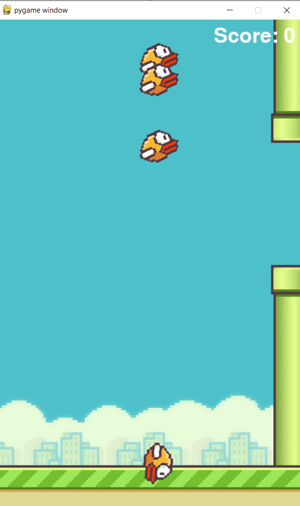
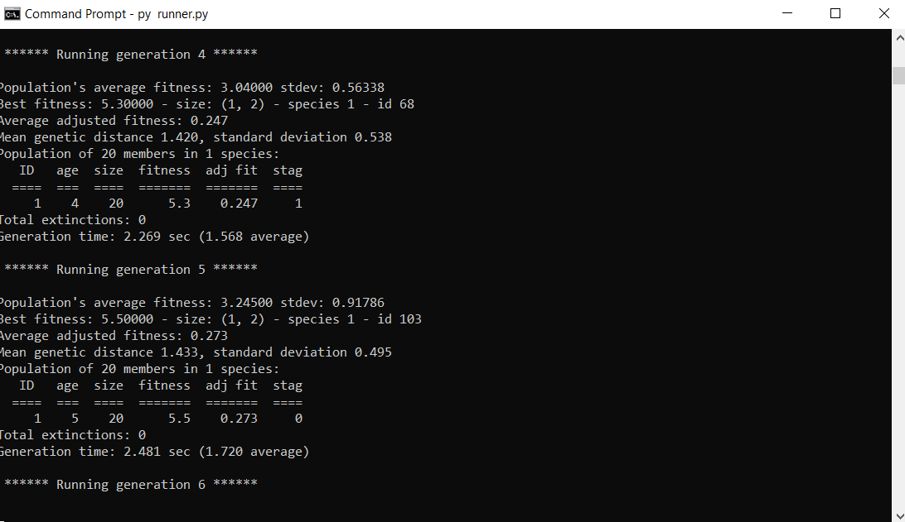
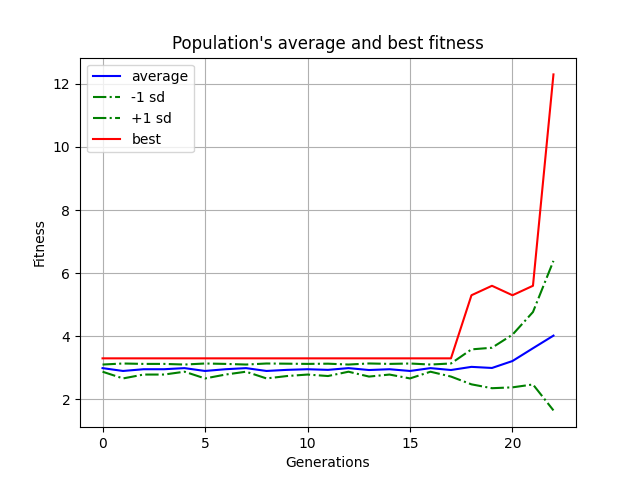

# Flappy-Bird-With-DL-and-Genetic-Algorithm
The project aims to teach a neural net how to play the famous game 'Flappy Bird'. To play the game deep learning and genetic algorithms are applied.

For applying genetic algorithm NEAT(Neuro Evolution of Augemting Topologies) is used. It alters both the weighting parameters and structures of networks, attempting to find a balance between the fitness of evolved solutions and their diversity. It is based on applying three key techniques: tracking genes with history markers to allow crossover among topologies, applying speciation (the evolution of species) to preserve innovations, and developing topologies incrementally from simple initial structures ("complexifying"). 

### Description of files
1. **base.py** &#8594; stores the class for the base of the game
2. **bird.py** &#8594; stores the class for the bird of the game
3. **pipe.py** &#8594; stores the class for the pipe in the games
4. **game.py** &#8594; stores the game object and has the 'run' method which is used by the genomes to generate birds in the game
5. **visualize.py** &#8594; stores the visualization methods
6. **runner.py** &#8594; main file and generates the config and the genome and runs the game for the genome
7. **configs/config-feedforward.txt** &#8594; stores the neat configuration and all the weights/initializarions/activation functions are defined using this configuration file. 

### Requirements
1. neat-python
2. numpy
3. graphviz
4. pygame

### Running the code
Open terminal/cmd in current working directory.  
Enter **python runner.py** and see the AI learn flappy bird.

### Sample Screenshots
Game|
:---:|
|

Cmd Output|
:----:|
|

### Average Fitness Plot
Average Fitness Plot|
:-----:|
|
